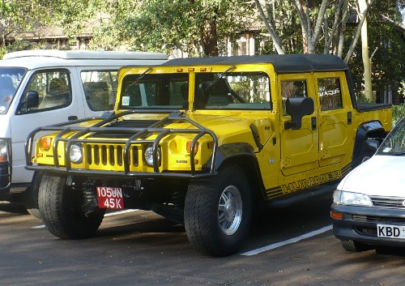
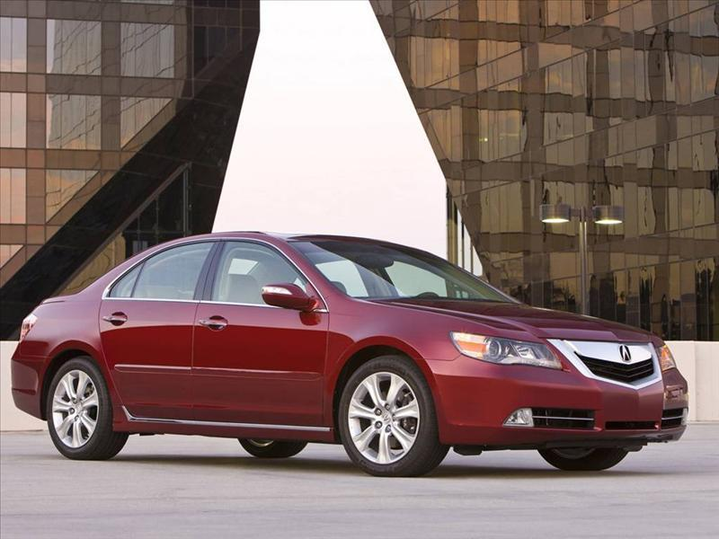
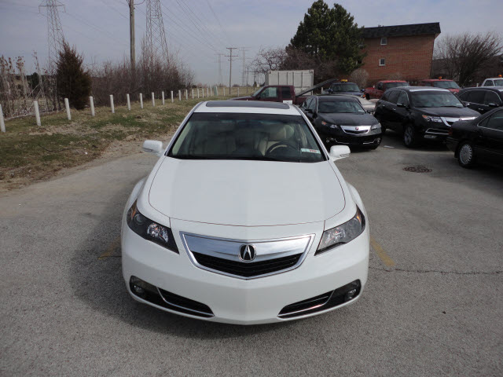

# Car-Brand-Classification
This project use pretrained ***wide residual network*** to do the car brand classification problem.
## Dataset
Dataset includes 11,185 training images and 5,000 testing images.
<p>
  
    
  
  
  
</p>


## Environment
```
torch 1.6.0
```
## Installation
Clone this repo.
  
  
## Pretrained model
 Used the pretrained weight by the following command
 ```
 model = torchvision.models.wide_resnet50_2(pretrained=True)
 ```
## Train
 ```python wide_residual_network.py```
## Testing Results
Since it's a kaggle competition, you have to submit your result on kaggle website.
  
